# Shoresh director guide

How to run your camp's schedule in Shoresh, step by step. Bold words are exactly what you'll see on screen.

---

## 1. Getting started

### First launch

1. Open Shoresh. You'll see **Set up this device**.
2. Pick one card:
   - **Start a new camp** — this is the first computer for your camp.
   - **Join with a camp code** — your camp already exists on another computer. Go to [Adding a device](#9-adding-a-device).

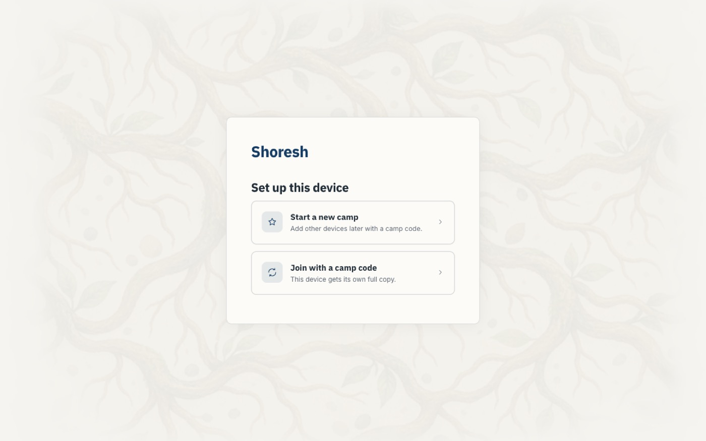

### Start a new camp

1. Type your **Camp name**.
2. Type **Your name**.
3. **Create a PIN** — 6 or more digits. Staff you add later can use a shorter one.
4. Click **Create camp**. (It stays grey until all three are filled in.)
5. You're in. No separate sign-in needed this time.

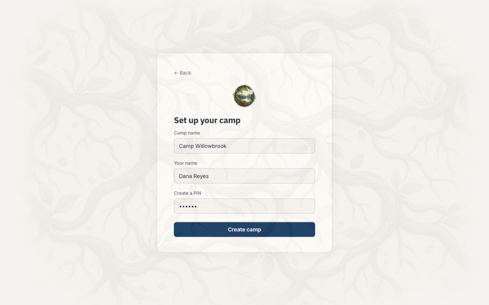

### Signing in later

1. Type your **Name**.
2. Type your **PIN**.
3. Click **Sign in**.

- Wrong PIN: you'll see a message saying it doesn't match. Try again.
- Too many tries: **Just a moment** appears with a countdown. Wait; it unlocks by itself.
- There is no "forgot PIN" button.

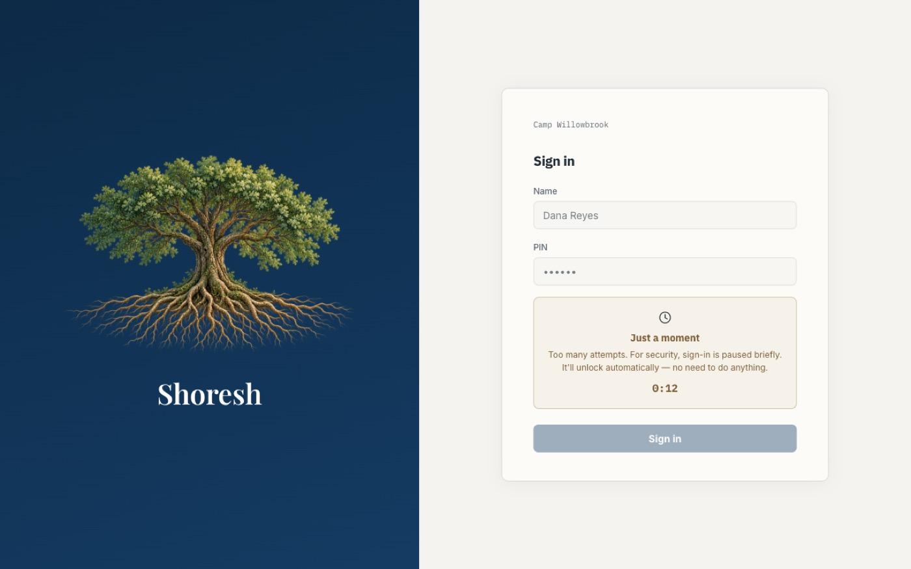

---

## 2. Import last year

### Start the import

1. On a brand-new camp you'll see **Seed your camp.** Click **Import last year**.
   - Camp already has data? Open the **Settings** gear and choose **Re-import last year**.
2. Drag your file onto **Drop schedule here**, or click **Choose a file**.
   - Works with .xlsx, .xls, .csv and .txt. You can pick several files at once.
   - Scanned images won't work.

[shot: import/drop-zone]

### Check what was found

1. Read **Found in the file. Nothing added yet.** Nothing has changed in your camp yet.
2. For each group, pick its age division from the dropdown (or **+ New age division…**).
3. Under **Longer Blocks**, choose **Every week** or **Just this once**.
4. Under **Similar names**, choose **Same — call it "…"**, **Keep both**, or **Not sure — ask me later**.
5. If your camp already has setup, choose:
   - **Keep them** — add the import alongside.
   - **Replace them** — clears your setup in every Program, and clears **Manual Build** and **Generated Schedule**.
6. Click **Review N records** (or **Replace with N records**).

[shot: import/preview]

### Answer the review questions

1. You'll see **Reconciling** your file name and a bar: **X of Y questions answered**.
2. Click a tile (**Needs attention**, **Changed**, …) to see its questions.
3. Answer what you can. **Unanswered is OK** — they're kept for later.
4. Click the button at the bottom:
   - **Use this setup** — everything is decided.
   - **Apply N decisions** — some answered, the rest kept for later.
   - **Add to camp** — first import, nothing answered yet.
5. Changed your mind? Click **Undo this import** within 5 minutes.
6. Click **Continue**.

[shot: reconcile/questions]

### Come back to open questions later

1. Click the attention item on the home screen. It opens **Open items**.
2. For each item, click **Open in … →** to fix it, or **Mark handled** to clear it from the list.

---

## 3. Set up by hand

Choose **Start by hand** on **Seed your camp.**, or use the sidebar. Every table has a blank row at the bottom: fill it in, then click **+ Add** (or press Enter). Each screen has a **Next** button at the bottom right.

### Age Divisions

1. Click **Age Divisions** in the sidebar.
2. Type a name (e.g. Yeladim).
3. Click **+ Add**.
4. Click **Groups →**.

### Groups

1. Type a group name (e.g. Bunk 1).
2. Pick its age division (optional).
3. Pick **All Day**, **Morning Only** or **Afternoon Only**.
4. Click **+ Add**.
5. Click **Days →**.

### Days

1. Type a label (e.g. Monday).
2. Pick the day of the week.
3. Click **+ Add**.
4. Click **Time Blocks →**.

### Time Blocks

1. Type a name (e.g. Block 1).
2. Set the start and end time.
3. Check **Morning**, **Afternoon** or **Evening**. Shoresh fills it in from the start time (before noon is morning, noon to 5 pm is afternoon, later is evening). Change it if you want.
4. Click **+ Add**.
5. Click **Activities →**.

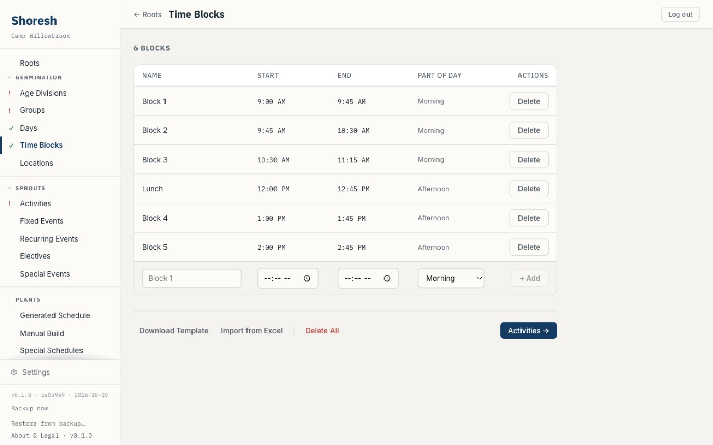

#### Flags on time blocks

- **Ends before start** appears under the end time when the block ends at or before it starts. **+ Add** (or **Save**, when you edit a block) stays grey until you fix it.
  - A block like this that was already saved, or came in from an imported file, shows the same flag. An imported one is held back until you fix it.
- **Overlaps** and the other block's name (for example, "Overlaps Block 2") appears on a row whose time runs into another block. This is a heads-up only. You can still save it, because some camps overlap blocks on purpose.
- When two blocks overlap, a group can hold only one of them on a given day. The Generated schedule won't put a group in both. In Manual Build, a group placed in both gets the overlap mark ([see below](#the-overlap-mark)).

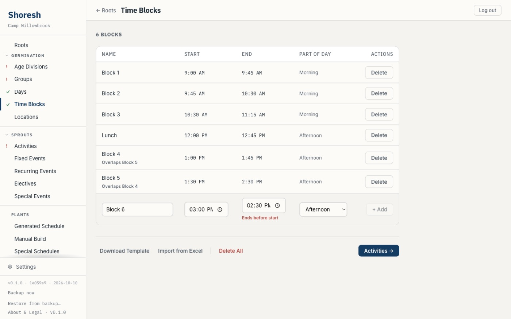

### Activities

1. Click **+ Add Activity**.
2. Fill in **Name** and, if you like, **Location (optional)**.
3. Set **Min per week**, **Max per week** and **Blocks per session**.
4. Pick **Scheduling Priority**: High or Low.
5. Tick the age divisions it's for — or leave all unticked for everyone.
6. Click **Add Activity**.

Quick way: type a name in the **Add Activity** box at the bottom and click **+ Add**.

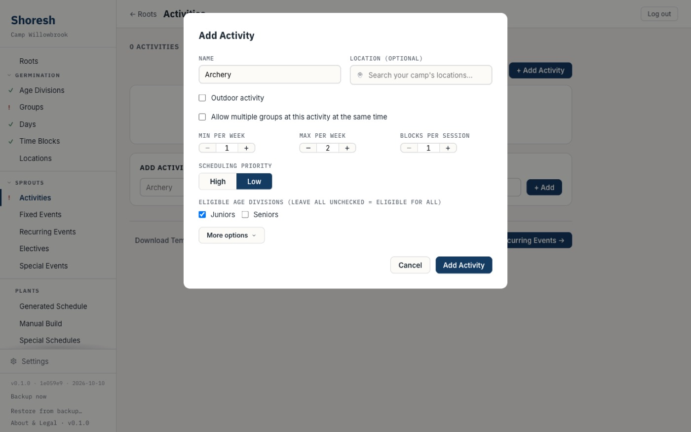

---

## 4. The Generated schedule

### Generate

1. Click **Generated Schedule** in the sidebar.
2. Click **Generate a schedule**. (Admins only.)
3. Wait for **Generating…** to finish. The week fills in.

[shot: generated/first-week]

### Unfillable cells

A cell that says **Unfillable** couldn't be filled. Hover it to see why:

- **Nothing eligible**
- **Weekly max reached**
- **Already on today**
- **Place full**
- **No room for full length**
- **Activity at capacity**
- **… in use by …** — another event has the place.

Click **Review all** to see everything in **Still to place**. Click **Accept** to hide a flag you're fine with.

[shot: generated/unfillable-hover]

### Drag to adjust

1. Switch to **Group View** or **Daily View**. (No dragging in **Activity View**.)
2. Drag an activity from the left panel onto a cell — or drag one cell onto another.
3. Dropping on a filled cell **replaces** it. It never swaps.
4. Made a mistake? Click Undo.

### Rebuild

1. Click **Rebuild**.
2. Click **Rebuild it**. Your edits are replaced, but the old week is saved to Versions first.

---

## 5. Manual Build

### Start a blank week

1. Click **Manual Build** in the sidebar.
2. Click **Start a blank week**. (Admins only.)
3. Your fixed events are placed for you. Everything else says **Open**.

Your Generated schedule is untouched. Switch between the two any time from the sidebar — nothing is lost.

### Place activities

1. Switch to **Group View** or **Daily View**.
2. Find an activity in the **Activities** panel (use **Filter…** to search).
3. Drag it onto an **Open** cell.
4. Watch the count next to each activity. When it turns red, that activity has hit its weekly max.

[shot: manual-build/dragging]

### The overlap mark

A small coloured dot in a cell means **Check this cell** — too many groups for one place or activity.

1. Hover the dot to read why.
2. Move one of the groups. The dot disappears by itself.

It's a warning, not a block. The **Overlapping** count at the top shows how many are left.

[shot: manual-build/overlap-dot]

---

## 6. Electives

### Make an elective set

1. Click **Electives** in the sidebar.
2. Type a name in the blank row (e.g. Afternoon Chugim). Press Enter.

### Add offerings

1. Click **Open** on the set.
2. Click **Import** to load offerings from a spreadsheet, or use **Add Offering** to pick activities one by one.
3. Set **Capacity** and **Minimum** if you need them.

[shot: elective-set/offerings]

### Put it on the week

From the grid you can reach a set two ways. Use either one.

**From the side panel:**

1. In Generated Schedule or Manual Build, look under **Elective sets** at the top of the left panel, above **Activities**.
2. Drag a set onto a cell.

The **Elective sets** section only shows once you have at least one set.

[shot: schedule/elective-sets-in-rail]

**From the cell:**

1. Click a cell. The list opens with your sets already showing under **Elective sets**.
2. Start typing to narrow the list, or pick one straight away. Each has a small **Elective** tag.
3. Press Enter, or click the set.

Either way the cell shows the set name and count, e.g. "Chugim (4)".

[shot: schedule/cell-editor-elective-sets]

Shortcut: type `Chugim: Archery, Drama` and press Enter to make a new set and place it in one go.

---

## 7. Special days

### Create a special day

1. Click **Special Events** in the sidebar.
2. Type a name (e.g. Color War).
3. Change the dropdown from **Event** to **Special Day**.
4. Click **+ Add**.

### Seed it from your time blocks

1. Shoresh asks **Start from your time blocks?**
2. Click **Copy time blocks** to start with your regular blocks — or **Empty** to start blank.

This is a one-time copy. Later changes to your time blocks won't follow.

### Fill it in

1. Click **Special Schedules** in the sidebar, then click your day.
2. **Double-click** a cell. (A single click won't open it.)
3. Type an activity and press Enter.
4. Need a new block? Click **+ Add Block**.
5. Click **Print** when you're done.

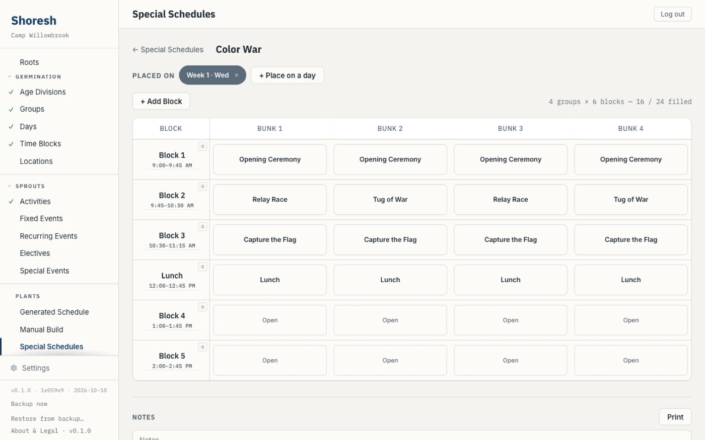

### Place it on a week and day

A special day only shows on your schedule once you place it on a week and a day. On that day, the special day's own grid replaces the regular one.

1. Click **Special Schedules** in the sidebar, then click your special day.
2. Find **Placed on** near the top.
3. Click **+ Place on a day**. A small grid opens, with one row per week and one column per day.
4. Click the cell for the week and day you want. A tick appears.
5. Click **Done**.

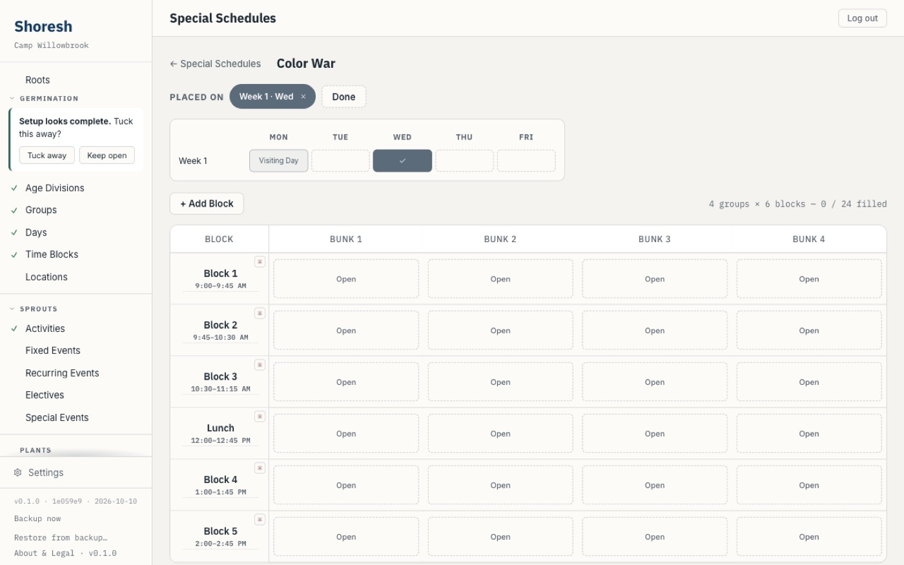

- **Placed on** now lists the day, for example "Week 1 · Mon".
- In **Special Schedules**, the special day shows its week and day underneath, e.g. "Placed Week 1 Mon". On several days it says "Placed 2 days".
- Open **Generated Schedule** or **Manual Build** and go to that week. The day shows the special day's grid. You can't edit it there. Click it to open the special day.
- A replaced day isn't counted in the schedule's totals, flags or overlap marks.
- Exports and printouts show the special day's grid for that day too.

[shot: generated/replaced-day]

You can place the same special day on more than one week and day.

### If the day is already taken

A week and day can hold only one special day.

1. Click a cell that is taken. It shows the other special day's name.
2. Read the question: the week and day, then "already uses" the other one. Use yours instead?
3. Click **Use** and your special day's name to swap. Click **Cancel** to leave it as it was.

The other special day isn't deleted. Place it on that week and day again to undo.

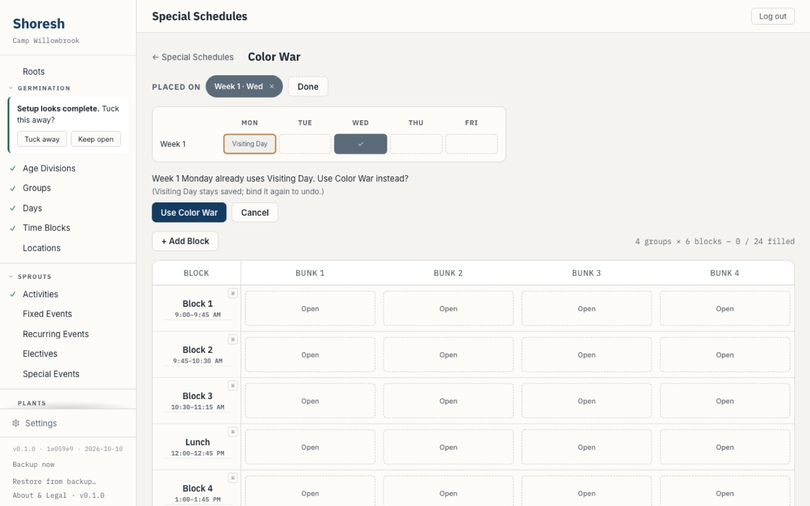

### Take it off a day

1. Open your special day, as above, and look under **Placed on**.
2. Click the small **x** on the week and day you want to remove.

Or:

1. Click **+ Place on a day**.
2. Click the ticked cell. Its tooltip says **Remove from this day**.
3. Click **Done**.

The special day stays saved and the regular schedule comes back on that day.

---

## 8. Backups

1. At the bottom of the sidebar, click **Backup now**.
2. Wait for **Backup saved**.
3. Click **Show in Finder** to see the file.

Backups go to `~/Library/Application Support/shoresh/backups/` on your Mac. Shoresh keeps the newest 10. Each backup includes the camp document as well as the database.

If you see **Backup saved — camp document not included**, the database was backed up but the camp document could not be copied. Click **Backup now** again; if the message keeps appearing, do not rely on that backup alone.

### Restoring from a backup

1. At the bottom of the sidebar, click **Restore from backup…** (directors only).
2. Choose a backup file from the `backups` folder. Pick the `.db` file; Shoresh finds the camp document saved beside it.
3. Read the confirmation. It names the backup's date and says it replaces this camp's data. Check the date, then click **Restore**. (**Cancel** leaves everything as it was.) Shoresh first saves a copy of your current data, then restores.
4. Wait for **Restored from backup.**

[shot: sidebar/restore-confirmation]

Restoring rebuilds *this computer* from the backup, then syncs. If other computers in the camp hold newer changes, those changes sync back to this computer. A restore does not roll back the other computers.

Backups made before backups included the camp document cannot be restored. Shoresh will say so, because the restore would be undone at the next sync. If a restore says it did not finish, your previous data was put back and nothing changed; if it also says to restart Shoresh, do that before anything else, because a copy of your previous data is in the backups folder.

The confirmation says it too: "Anything erased since then may reappear until other devices sync." So if you erased records after the backup was made, they can come back on this computer until the other computers sync.

Your best protection is still a second computer joined to the camp — it keeps a full copy all the time.

---

## 9. Adding a device

Both computers must be on the **same Wi-Fi**. VPN and phone hotspots won't work.

**On the host computer** (the one the camp was set up on, unless you moved hosting — see [Moving hosting to another computer](#moving-hosting-to-another-computer)):

1. Open the **Settings** gear → **LAN & Devices**.
2. Click **Add a device**.
3. Note the camp code shown. It's the same every time.

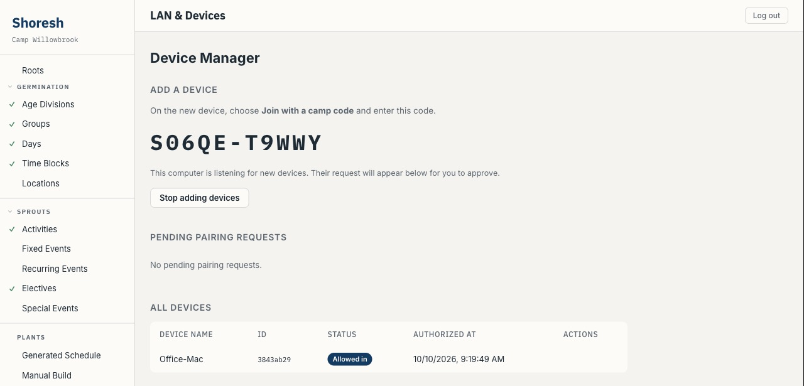

**On the new computer:**

4. Choose **Join with a camp code**.
5. Type the code. Click **Continue**.

**Back on the first computer:**

6. The new computer appears under **Pending Pairing Requests**. Click **Approve**.

**On the new computer:**

7. Sign in with the same **Name** and **PIN** you use on the first one.
8. Wait for **Getting your camp…**, then click **Continue**.

If it says **No camp answered that code**, check the code, check **Add a device** is still open, and check both are on the same Wi-Fi.

### Moving hosting to another computer

Only the host computer can add devices. If that computer is being replaced or turned in, hand hosting to another computer that is already joined to the camp. That computer must be a director's (admin) device.

1. Make sure both computers are open, signed in, and on the **same Wi-Fi**.
2. On the current host, open the **Settings** gear → **LAN & Devices**.
3. On the other computer's row, click **Hand hosting to <name>**.
4. On the other computer, read the message and click **Make this the host**. (**Cancel** leaves everything as it was.)
5. Both apps restart. Wait until the new computer shows the camp code under **Add a device**.

Do not close, turn in, or restore the old computer until the new one shows the camp code. The old computer stays in the camp as an ordinary device and keeps syncing.

If you see **Handoff did not complete**, nothing changed and the old computer is still the host — try again. If the new computer says it **could not finish taking over**, keep both computers open on the same Wi-Fi; it tries again by itself. If it keeps failing, restart the new computer.

**If the old computer is already gone or broken:** export your schedule (section 10), start a new camp on the new computer, and use **Import last year** to bring the file in. Then join your other computers to the new camp.

### Pair again: a laptop that can't reach its camp

Say a laptop was switched off, or away from camp, while another device was removed from the camp. When it comes back it may not be able to find the others. Shoresh waits several hours with no camp device reachable before it tells you. Laptops that are just closed overnight shouldn't trigger it.

When it does, you'll see a red dot at the bottom of the sidebar:

**can't reach the camp · pair again on the camp's network**

Fix it from the laptop that shows the flag, and one other camp computer. Both must be on the camp's Wi-Fi.

**On a camp computer that is working:**

1. Open the **Settings** gear → **LAN & Devices**.
2. Click **Add a device**.
3. Note the camp code.

**On the laptop with the flag:**

4. Click the flag. The **Pair again** screen opens.
5. Type the camp code. Click **Continue**.
6. If it shows **Waiting for approval**, go to the camp computer and click **Approve** under **Pending Pairing Requests**.
7. Type your **Name** and **PIN**. Click **Sign in**.
8. Wait for **Getting your camp…**.
9. You'll see **Back in** and your camp's name, with "Your changes from this device are merged in." Click **Continue**.

[shot: sidebar/cant-reach-the-camp-flag]
[shot: pair-again/code-screen]

- Your changes on the laptop are kept.
- If the camp deleted a record while the laptop was away, the delete stays. Your offline edits to that record don't bring it back.
- A message that says **Update Shoresh on this device first** (or on the camp device) means the two have different versions. Update, then try again.
- A message that says a director removed this device means it can't pair again. A director adds it as a new device instead, as in [Adding a device](#9-adding-a-device).

### The router flag on LAN & Devices

On **LAN & Devices**, right under the **Device Manager** title, Shoresh sometimes shows one small grey line with a short explanation. It's about your router. It lets camp computers that are on other networks connect to this one directly. It is information only. There is nothing to click.

[shot: devices/router-flag]

It appears only when cross-network reconnect is on. If your copy of Shoresh doesn't use it, you'll never see this line, and that's normal. Computers on the same Wi-Fi never need it. When the router opening works, nothing shows.

What each line means:

| You see | What it means for you |
| --- | --- |
| **Router opening stays set** | Your router is keeping the opening. Other camp devices can reach this computer directly. Nothing to do. |
| **Router declined a direct path** | The router said no. Same-Wi-Fi devices are fine. A device on another network may not connect directly. |
| **No router to ask** | Shoresh couldn't find a router it can ask. Common on camp, school and phone-hotspot networks. Same-Wi-Fi devices are fine. |
| **Another router sits in front of this one** | A second router, or your internet provider, is in front of yours, so opening a path here wouldn't help. Same-Wi-Fi devices are fine. |
| **Shoresh's connection spot is busy** | Another program on this computer is using the spot Shoresh wants. Close other copies of Shoresh and reopen it. Same-Wi-Fi devices are fine. |
| **Couldn't check the router** | Something went wrong while Shoresh talked to the router. Same-Wi-Fi devices are fine. |

---

## 10. Export to Excel

1. Open **Generated Schedule** or **Manual Build**.
2. Click **Export to Excel**.
3. If both schedules are started, **Export which?** asks you to pick one. (It asks every time.)
4. The file downloads with one sheet per day and an **All Groups** sheet.
5. A day replaced by a special day prints as that special day's grid and notes, labelled with the week and weekday.

Before the season ends, export your final schedule to keep a copy (steps above). Then continue to [End of season](#11-end-of-season-clear-elective-choices).

---

## 11. End of season: clear elective choices

### First: update campers in Excel (optional)

Do this **before** you clear choices. A camper with no choices is not in the file.

1. Click **Electives** in the sidebar.
2. At the bottom right, click **Download campers**. (Directors only.) You get `shoresh_campers.xlsx`.

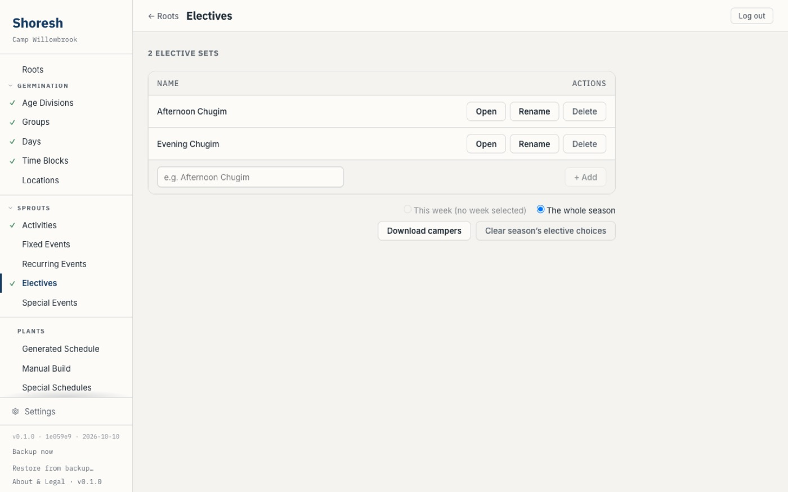

3. Edit it in Excel — for example, fix a camper's **Division**. Keep the **Camper ID** column as it is. A camper with no Camper ID is matched by name, so don't rename those.
4. Import it back like a camper preference sheet: open an elective set, click **Import Camper Preferences**, pick the file, then click **Commit Assignments**. The campers in the app update.

No camper is added twice and none is removed.

[shot: electives/camper-import-preview]

### Then: clear elective choices

1. Click **Electives** in the sidebar.
2. At the bottom right, pick **The whole season** (or **This week**).
3. Click **Clear season's elective choices**. (Admins only.)
4. Read the warning. This can't be undone, and it clears every device.
5. Click **Clear Season**.

This clears campers' choices and assignments only. Your elective sets and offerings stay.

Campers themselves stay in the app — there is no way to remove a camper. Before you leave for the season, export a final copy (section 10) so you have everything in Excel.

> **Careful:** **Re-import last year** (Settings gear) brings in camp *setup*, not campers. If your camp already has data and you choose **Replace them**, it clears your Age Divisions, Groups, Days, Time Blocks and Activities first.
